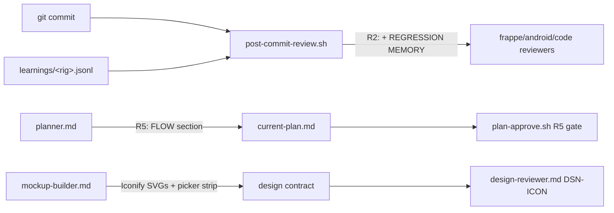

PLAN: harness-upgrades-r2-r5-iconify
====================================
User-approved 2026-07-22 ("If you say so, then can proceed") — implement the two
quickest harness upgrades from today's survey plus the Iconify front-end rule.
Supersedes the completed 1-2-shot plan (7/8 phases shipped 2026-07-20).

ASSUMPTIONS:
  - R2 injects learnings at hook level (post-commit-review.sh), keeping reviewer
    agent prompts unchanged; learnings joined inline to stay JSON-safe.
  - R5 gate mirrors the MOCKUP gate contract: FLOW section required, with
    "NOT NEEDED (<reason>)" escape for single-file/no-dependency work.
  - Iconify rule lives in mockup-builder (icon sourcing + 2-3 candidate picker
    strip) and design-reviewer (DSN-ICON checks); mockup-builder gains Bash
    solely to curl SVGs from api.iconify.design (verified reachable).

FLOW:

STEPS:
  1. R2 — core/hooks/post-commit-review.sh: after app-type detection, read
     ~/.claude/pipeline/learnings/<rig>.jsonl (rig = repo basename), join the
     last ~6 .learning values into a single-line REGRESSION MEMORY segment
     (double quotes stripped), append to the reviewer systemMessage.
     → verify: bash -n + jq parse of hook output on a synthetic input.
  2. R5 — core/hooks/plan-approve.sh: add check 2.5 requiring a FLOW section
     (mermaid fence or edge arrows) or FLOW: NOT NEEDED (<reason>).
     → verify: bash -n; this very plan passes the new check.
  3. R5 — core/agents/planner.md: add "Draw the flow" step (derive from
     .wiki/graph.json / graph_neighbors when present, else read imports),
     add FLOW to the strict output format and rules.
  4. Iconify — core/agents/mockup-builder.md: icon system rules (Iconify only,
     one set per project recorded in design-tokens.css, inline SVGs via
     api.iconify.design, icon-picker strip with 2-3 candidates per NEW action,
     recommended preselected); add Bash to tools for the curl.
  5. Iconify — core/agents/design-reviewer.md: add DSN-ICON checks (mixed icon
     sets, emoji-as-icons, off-scale sizes, icon-only controls without labels,
     picked-icon contract deviations).
  6. Commit (feat) + push; build the Iconify icon-suggestion demo artifact
     from real fetched SVGs.

MOCKUP: NOT NEEDED (hook + agent-prompt changes; the icon-suggestion visual
ships as a claude.ai artifact demo, not app UI).

EXPECTED OUTPUT:
  - Code: post-commit-review.sh, plan-approve.sh, planner.md,
    mockup-builder.md, design-reviewer.md edited in /root/humanless-pipeline.
  - Behavior: reviewers open with this repo's past failure classes; plans
    refuse approval without a FLOW graph; every future mockup uses Iconify
    icons and presents 2-3 candidates per new action for user pick.
  - Ships as: commit + push to humanless-pipeline (hooks live immediately via
    ~/.claude symlinks); demo artifact link in the reply.

PIPELINE SUMMARY:
  requirements (user-approved recommendations) → inline advisor edits (small,
  judgment-heavy config changes) → no mockup → no TDD (hook/prompt config;
  verify via bash -n + synthetic hook run) → commit → auto-review (post-commit
  hook, generic path) → no deploy (not desktop/host-service).

RISKS:
  - Hook output is hand-built JSON with embedded quotes (pre-existing);
    learnings text stripped of double quotes so R2 cannot worsen it.
  - New FLOW gate refuses older plan styles: intended, matches MOCKUP gate.

NEXT_ACTION: APPROVED (user, this session)
